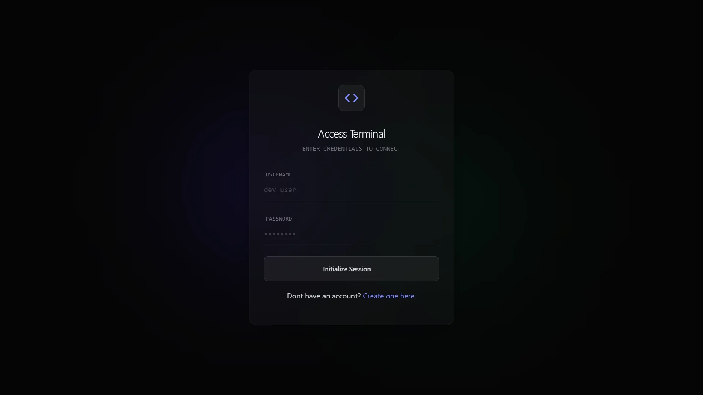
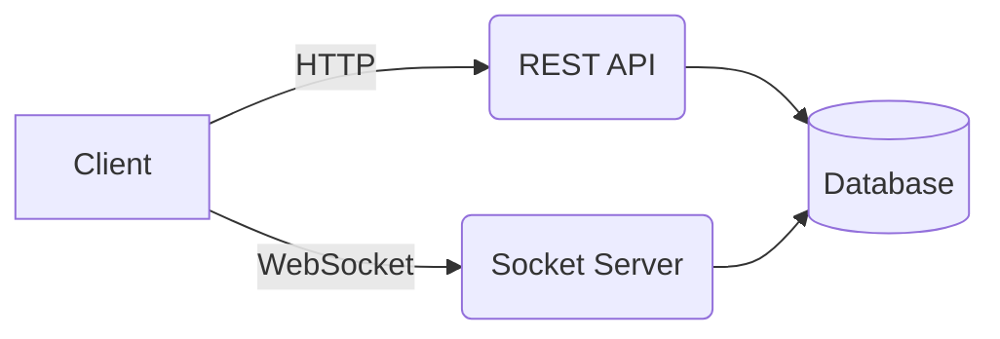

<div align="center">
  

  # Chat App

  **Communicate safely with your friends.**

  [](https://opensource.org/licenses/MIT)
  []()
  []()
  []()

  [View Demo](https://your-demo-link.com) • [Report Bug](https://github.com/PedroFranca404/chat-app/issues) • [Request Feature](https://github.com/PedroFranca404/chat-app/issues)
</div>

---

## About The Project

Chat App is a modern, real-time messaging platform designed to provide a simple and secure communication experience. Built for **Commit PT**, this project focuses on User Experience (UX), User Privacy, and Low-Latency.

We chose this project because we believe communication should be accessible, private, and fast—without the bloat.

### Key Features

*   **Real-time Messaging:** Instant message delivery using WebSockets.
*   **Secure Authentication:** Robust user login and registration system.
*   **File Sharing:** Easily share images and documents with peers.
*   **Modern UI/UX:** Fully responsive design with Dark Mode support.
*   **Friendships:** Never miss a message from your friends.
*   **Activity Tracker:** Compare your activity with your friend's.
*   **Group Chats:** Create rooms and hang out with multiple friends.

---

## Screenshots

<div align="center">
  
  <br><br>
  
</div>

---

## Tech Stack

This project was built using the following technologies:

| Category | Technology |
| --- | --- |
| **Frontend** | React, TailwindCSS, TypeScript |
| **Backend** | Go, Gorm |
| **Database** | Postgres |
| **Real-time** | WebSocket Protocol |
| **Authentication** | Custom ClientID, Bcrypt |
| **Deployment** | Vercel |

---

## Architecture

The application follows a client-server architecture. The frontend communicates with the REST API for standard requests (auth, history) and establishes a persistent WebSocket connection for real-time events (typing indicators, new messages).



---

## Getting Started

Follow these steps to set up the project locally.

### Prerequisites

*   Golang
*   Node.js (v14 or higher)
*   npm
*   A Postgres database 

### Installation

1.  **Clone the repository**
    ```bash
    git clone https://github.com/PedroFranca404/chat-app.git
    cd chat-app
    ```

2.  **Install dependencies (Frontend & Backend)**
    ```bash
    # Backend
    cd backend
    go mod tidy

    # Frontend
    cd ../frontend
    npm install
    ```

3.  **Environment Variables**
    Copy the `.env` example file and rename it to `.env`. Add your free Prisma's API key.

4.  **Run the application**

    *Open two terminals:*

    Terminal 1 (Backend):
    ```bash
    cd backend
    go run main.go
    ```

    Terminal 2 (Frontend):
    ```bash
    cd frontend
    npx vite
    ```

5.  **Access the app**
    Open the URL given by npm to view it in the browser.

---

## Contributing

Contributions are what make the open-source community such an amazing place to learn, inspire, and create. Any contributions you make are **greatly appreciated**.

1.  Fork the Project
2.  Create your Feature Branch (`git checkout -b feature/AmazingFeature`)
3.  Commit your Changes (`git commit -m 'feat: Add some AmazingFeature'`)
4.  Push to the Branch (`git push origin feature/AmazingFeature`)
5.  Open a Pull Request

---

## Authors

*   **Pedro França** - *Designer/Developer* - [PedroFranca404](https://github.com/PedroFranca404)
*   **Luís Almeida** - *Designer/Developer* - [Luís605](https://github.com/luis605)

---

## License

Distributed under the MIT License. See `LICENSE` for more information.

---

<div align="center">
  <b>⭐️ Don't forget to star this repo if you found it useful! ⭐️</b>
</div>
